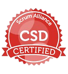

# Welcome to My GitHub Profile! 👋

## About Me 🙋🏽

I am Cesar Morales Onya, a passionate about technolgy specializing in HealthTech solutions. My expertise includes:

- **Problem-Solving**: Tackling complex technical challenges in health technology.
- **Solution Architecture**: Designing efficient and scalable technological infrastructures.
- **Mechatronic Solutions**: Integrating electronic and computing systems for innovative health products.
- **Project Leadership**: Leading technological projects from concept to successful execution.

## Skills and Technologies 💻

- **Design**: C4Model, draw.io, excalidraw, structurizr and Structure101 (Sonar now).
- **Mobile**: Flutter.
- **Frontend**: Angular and React.
- **Cloud**: Amazon Web Services and Azure.
- **Frameworks**: .NET, NodeJS, FastApi, Hexagonal Architecture, Domain Driven Design, Microservices, DevSecOps and Data Mesh.
- **Tools**: Docker, CI/CD pipelines, Sonar, Lizard, IaC and Large Language Models (LLMs).
- **Programming Languages**: C#, C++, TypeScript, Python and Shell scripting.

## Certifications 📜

                      

## Let's Connect 📬

- **LinkedIn**: [Cesar Morales Onya](https://www.linkedin.com/in/cesarmoralesonya/?locale=en_US)
- **Personal Website**: [cesarmoralesonya.es](https://cesarmoralesonya.es)
- **Email**: [me@cesarmoralesonya.es](mailto:me@cesarmoralesonya.es)
- **Whatsapp**: [direct message](https://wa.me/34635365817)

## GitHub Stats 📊

Thank you for visiting my profile! 😊
